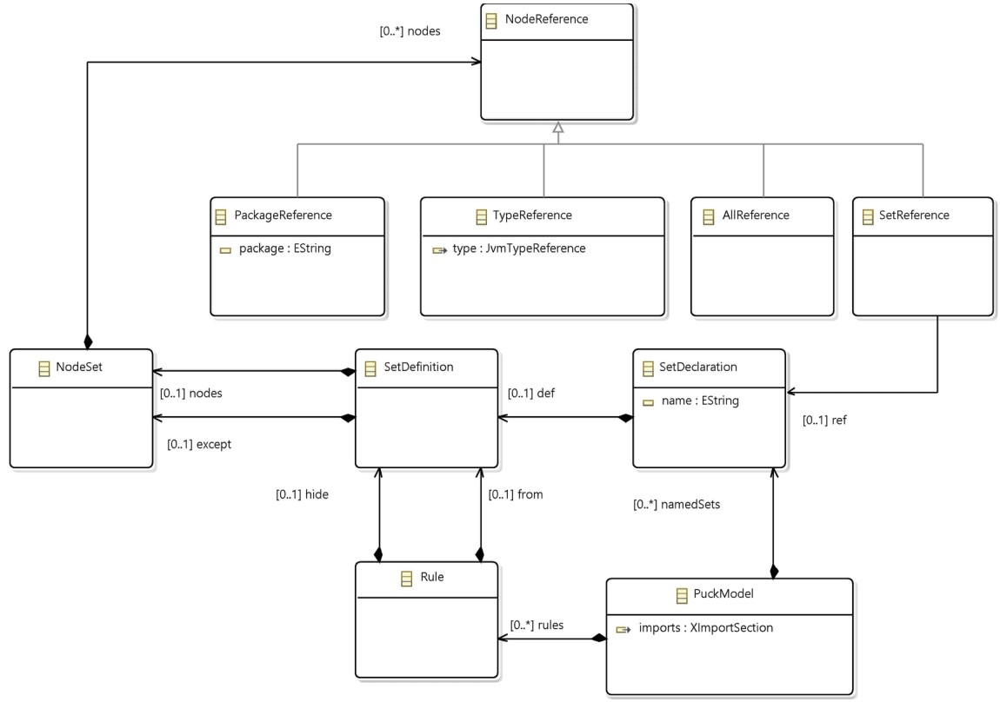

# Puck3
Development of Puck 3 DSL.

Update site for latest release : https://yanntm.github.io/Puck3/updates

Javadoc of the API : https://yanntm.github.io/Puck3/apidocs

Puck Metamodel : 

# 15 juin 2020
Prochaines étapes possibles.

Considérer des bases de code pour trouver un killer example.
Idée 1 : formaliser une contrainte pour chaque pricinpe SOLID sauf Liskov 
Remarque de Mikal : il faut contextualiser chaque contrainte en fonction des axes de changement donc je suis sceptique sur la faisabilité car le principe le plus général est caché ce qui change, donc cela présuppose de savoir ce qui change.
Débat : peut-on savoir a priori ce qui va changer ?

ISP : il est envisageable d'essayer de modifier une interface en fonction des besoins de tel ou tel client.
Mikal : oui mais ISP doit typiquement gérer un compromis entre souplesse et sécurité. Le bon compromis dépend de chaque cas.
Donc ISP doit etre paramétré par les méthodes à garder dans une interface. Mais alors qu'apporte une règle et un outil qui supporte ISP par rapport à faire tout à la main ?
Réponse : on détecte des incohérences et on fait l'évolution du code client et des classes qui implémentent l'interface pour s'adapter au changement d'interface.

DIP : on peut imaginer une heuristique qui avertit quand une classe concrète est utilisée directement.
Mikal : attention en fait cela ne pose souvent pas de problème, notamment quand la classe concrète n'est pas amenée à évoluer.
Il y aurait donc beaucoup de faux positifs.
Il faudrait au moins enrichir la notion de concret/abstrait avec d'autres cas. nombre magique, code vs fonction, attributs vs classe, classe vs interface, if vs polymorphisme (replace condtionnal polymorphism)...
Prévoir des refectoring pour corriger ces erreurs typiques.

Trouver des arguments pour répondre à la critique attendue : si on connait les axes de changements pourquoi utiliser puck vu qu'alors je peux coder proprement.

Argument 1 : code decay. D'autres personnes voire le développeur initial peuvent par mégarde ou méconnaissance ne pas respecter les contraintes architecturales et abimer peu à peu l'architecture. L'outil permet à ton instant un audit pour détecter tout souci voire proposer des corrections. Les règles documentent aussi certaines hypothèses et contraintes pour les nouveaux dans l'équipe de développement.

Argument 2 : évolutions des besoins. A un moment donné telle architecture convient parce qu'on ne sait pas que tel aspect va changer. Quand on est prévenu il faut remanier l'architecture.

Argument 3 : c'est beaucoup plus facile de déclarer des axes de changement (ensembles weland) que de respecter des contraintes tout le temps.

Argument 4 : le fait d'expliciter les axes de changement permet justement d'en prendre conscience et de les respecter. Ceci est un argument pour la démarche que pour l'outil. 
Argument 4 bis : comparaison avec l'encapsulation. Tout le monde sait qu'il faut cacher les attributs d'une classe (les déclarer privés) mais le fait de les déclarer et que le compilateur fasse recpecter l'encapsulation est un vrai plus.

On peut donc imaginer un niveau basique sans connaissance a priori sur les changements et un niveau plus avancé où l'outil affine ses remarques et propositions en fonction des hypothèses sur les changements.
